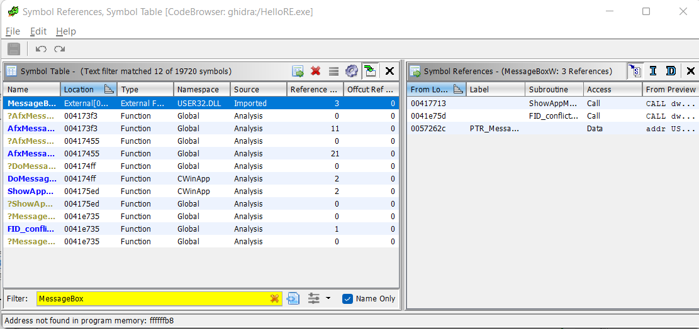
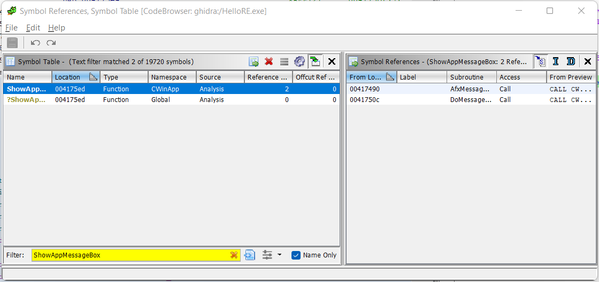
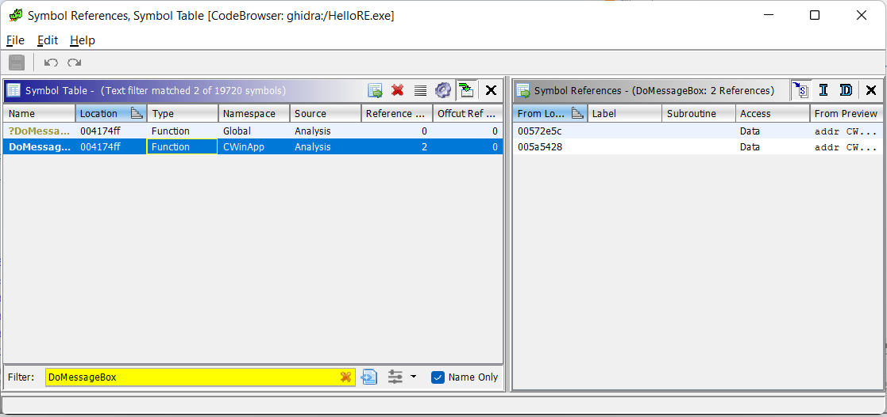
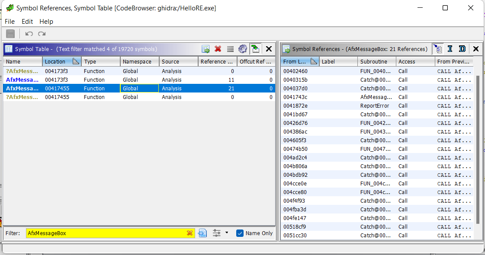
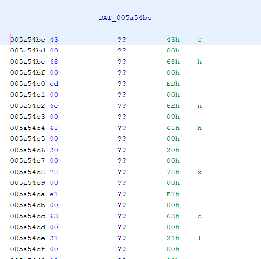
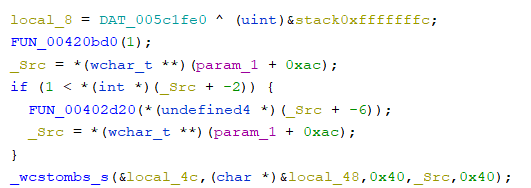
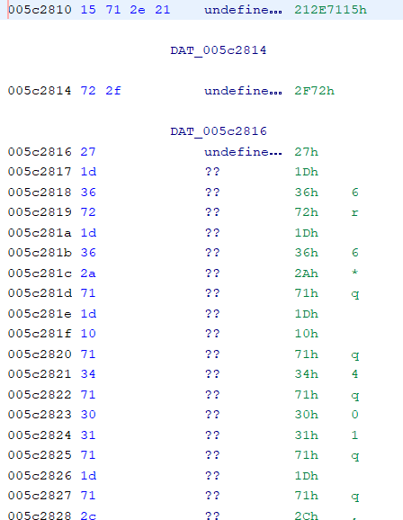
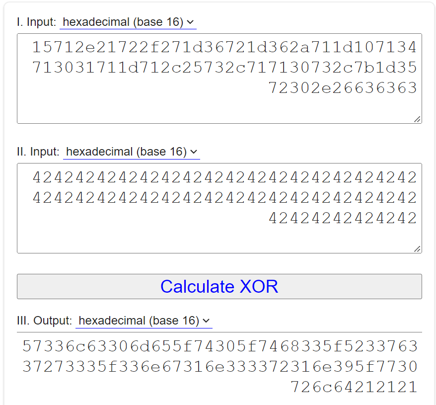

# Analysis

Run the app and enter some random strings, a MessageBox popped out shown that it is incorrect.


So it seems like there is a check somewhere that shown the corresponding message to what we entered.

# Reverse

* Fire up Ghidra, and keep in mind that the check will call a MessageBox, we will first search for any calls to MessageBox.



* The second call, which is from FID_conflict:MessageBox doesn't show anything useful, so we can ignore it.


* So, we're left with the ShowAppMessageBox one. Let's see which function call this function.



* Again, there are 2 calls to this function, but still we can skip the DoMessageBox one, since there is no subroutine for it.



* So we'll deal with this AfxMessageBox guy. Keep digging up, we see that there are several calls to this guy. 



* Notice that we only search for user call, so just check whichever has the "FUNC" prefix. Let's try the first one.

```
void __fastcall FUN_00402390(int param_1)

{
  uint *puVar1;
  uint *puVar2;
  wchar_t *_Src;
  uint *puVar3;
  wchar_t *pwVar4;
  uint *puVar5;
  uint uVar6;
  bool bVar7;
  size_t local_4c;
  uint local_48;
  undefined4 uStack68;
  uint uStack64;
  uint uStack60;
  uint local_38;
  uint uStack52;
  uint uStack48;
  uint uStack44;
  uint local_28;
  uint uStack36;
  uint uStack32;
  uint uStack28;
  uint local_18;
  uint uStack20;
  uint uStack16;
  uint uStack12;
  uint local_8;
  
  local_8 = DAT_005c1fe0 ^ (uint)&stack0xfffffffc;
  FUN_00420bd0(1);
  _Src = *(wchar_t **)(param_1 + 0xac);
  if (1 < *(int *)(_Src + -2)) {
    FUN_00402d20(*(undefined4 *)(_Src + -6));
    _Src = *(wchar_t **)(param_1 + 0xac);
  }
  _wcstombs_s(&local_4c,(char *)&local_48,0x40,_Src,0x40);
  uVar6 = 0x27;
  local_48 = local_48 ^ 0x42424242;
  uStack68 = uStack68 ^ 0x42424242;
  uStack64 = uStack64 ^ 0x42424242;
  uStack60 = uStack60 ^ 0x42424242;
  local_38 = local_38 ^ 0x42424242;
  uStack52 = uStack52 ^ 0x42424242;
  uStack48 = uStack48 ^ 0x42424242;
  uStack44 = uStack44 ^ 0x42424242;
  local_28 = local_28 ^ 0x42424242;
  uStack36 = uStack36 ^ 0x42424242;
  uStack32 = uStack32 ^ 0x42424242;
  uStack28 = uStack28 ^ 0x42424242;
  local_18 = local_18 ^ 0x42424242;
  uStack20 = uStack20 ^ 0x42424242;
  uStack16 = uStack16 ^ 0x42424242;
  uStack12 = uStack12 ^ 0x42424242;
  puVar1 = &DAT_005c2810;
  puVar2 = &local_48;
  do {
    puVar5 = puVar2;
    puVar3 = puVar1;
    if (*puVar5 != *puVar3) goto LAB_00402456;
    bVar7 = 3 < uVar6;
    uVar6 = uVar6 - 4;
    puVar1 = puVar3 + 1;
    puVar2 = puVar5 + 1;
  } while (bVar7);
  if ((*(short *)(puVar5 + 1) != *(short *)(puVar3 + 1)) ||
     (pwVar4 = (wchar_t *)&DAT_005a54bc, *(char *)((int)puVar5 + 6) != *(char *)((int)puVar3 + 6)) )
  {
LAB_00402456:
    pwVar4 = (wchar_t *)&DAT_005a54d4;
  }
  AfxMessageBox(pwVar4,0,0);
  FUN_00545f7f();
  return;
}
```

* Okay so we can see that at the end of the function it calls AfxMessageBox with <span style="color:red">*pwVar4*</span> as the message to be displayed.  

* This <span style="color:red">*pwVar4*</span> is assigned with value before it is being used (<span style="color:red">*DAT_005a54bc*</span> or <span style="color:red">*DAT_005a54d4*</span>). Lets check on those guys.



* So apparently, this looks like "Chính xác!", and the other one is "Không chính xác!". Seem like we're in the right spot. 

* Okay lets move on. 

 

* Here, since ghidra can guess function's parameters' and variables' names, we can assume that user's input is retrieved by the <span style="color:red">*FUN_00420bd0*</span> function, and move into <span style="color:red">*_Src*</span>. It is finally converted to string, stored in <span style="color:red">*local_48*</span>. (by <span style="color:red">*_wcstombs_s*</span>).

* Down here, <span style="color:red">*local_48*</span> is XOR with 0x42424242, then moved to  <span style="color:red">*puvar2*</span>. And <span style="color:red">*puVar1*</span> is assigned with value from  <span style="color:red">*DAT_005c2810*</span>, which is: 



* In short, <span style="color:red">*puVar1*</span> is 
```
15712e21722f271d36721d362a711d107134713031711d712c25732c717130732c7b1d3572302e26636363
```
And <span style="color:red">*puVar2*</span> is user's input's XOR with 0x42424242.

* The following code shows that we will XOR each byte of user's input with 0x42424242 at a time. 
```
  do {
    puVar5 = puVar2;
    puVar3 = puVar1;
    if (*puVar5 != *puVar3) goto LAB_00402456;
    bVar7 = 3 < uVar6;
    uVar6 = uVar6 - 4;
    puVar1 = puVar3 + 1;
    puVar2 = puVar5 + 1;
  } while (bVar7);
```

* So in order to decrypt this, we just have to perform a XOR operation of user's input with <span style="color:red">*puVar1*</span>.



* Convert this to ASCII and we have cracked the program.

```
key : W3lc0me_t0_th3_R3v3rs3_3ng1n33r1n9_w0rld!!!
```
